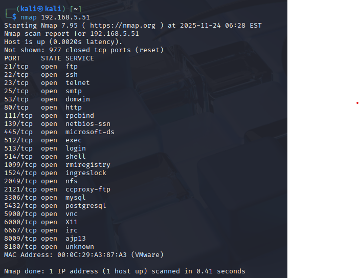

# ITSE Arbeitsbericht
## Meta Informationen
Klasse: 4AHITS  
Name: David Weinberger   
Fach: ITSE-Labor   
Datum: 24.11.2025     

## Übung(port probing)
 
### Angabe
Beim port probing möchte man herausfinden ob auf einem gewissen port ein Dienst läuft, welcher Dienst dies ist und (wenn möglich) mehr Details wie z.B. Versionsnummern. Diese Information dient als Basis für weitere Angriffe.

telnet, nc (netcat) und curl sind einfache Tools die zum port probing verwendet werden können. Teilweise ist es auch möglich die kontaktierten Dienste dazu zu veranlassen mehr Informationen über sich preiszugeben (banner grabbing).

Verwende telnet um festzustellen ob ein ssh Server auf Metasploitable läuft
Finde Bezeichnung und die Versionsnummer des Web Servers auf Metasploitable heraus. Auf 3 unterschiedliche Arten:
Verwende telnet
Verwende nc (netcat)
Hinweis: der notwendige http request header kann am besten mit Hilfe eines Shell here-documents beschrieben werden.
Verwende curl
Erstelle ein port probing cheat sheet für alle 3 Tools

### Lösung
In Kali das Terminal öffnen und folgenden Befehl eingeben

telnet IP von Meta 22 -> 
```
telnet 192.168.6.51 22
 ```
Wenn eine Verbindung hergestellt wird, läuft ssh

Dann zeigt ssh folgenden Banner: SSH-2.0-OpenSSH_4.7p1 Debian-8ubuntu1
 
### 1.2 Bezeichnung und die Version des Webservers herausfinden (Port 80)
 
#### mit telnet

Befehl: telnet <IP> 80
In meinem Fall ist es folgender Befehl:
```
telnet 192.168.5.51 80
```
Dann steht anfangs:
```
Trying 192.168.6.51
```
Dann wechselt es auf Connected und anschließend steht dann das der Escape Character "^]" ist
Hier gibt man dann folgendes ein:
```
HEAD / HTTP/1.0
```
(Enter, Enter)

##### Ausgabe:

HTTP/1.1 200 OK
Date: Mon, 20 Oct 2025 13:19:33 GMT
Server: Apache/2.2.8 (Ubuntu) DAV/2
X-Powered-By: PHP/5.2.4-2ubuntu5.10
Connection: close
Content-Type: text/html

#### Mit netcat

Hier verwendet man ein sogenanntes Here-Document:

nc <IP-ADRESSE> 80 <<EOF
HEAD / HTTP/1.0
EOF
 
Ausgabe: Server: Apache/2.2.8 (Ubuntu) DAV/2
 
#### Mit curl

Befehl:
```
curl -I http://192.168.5.51/
```
 
##### Ausgabe:
```
HTTP/1.1 200 OK
Server: Apache/2.2.8 (Ubuntu) DAV/2
X-Powered-By: PHP/5.2.4-2ubuntu5.10
Content-Type: text/html
```

## Übung (netcat port scan)
 
Befehl:
```
nc -zv 192.168.6.51 1-30
```

| Port | Dienst | Typische Bedeutung      |

| ---- | ------ | ----------------------- |

| 21   | FTP    | Dateiübertragung        |

| 22   | SSH    | Remote Shell            |

| 23   | Telnet | Remote Shell (unsicher) |

| 25   | SMTP   | Mailserver              |



